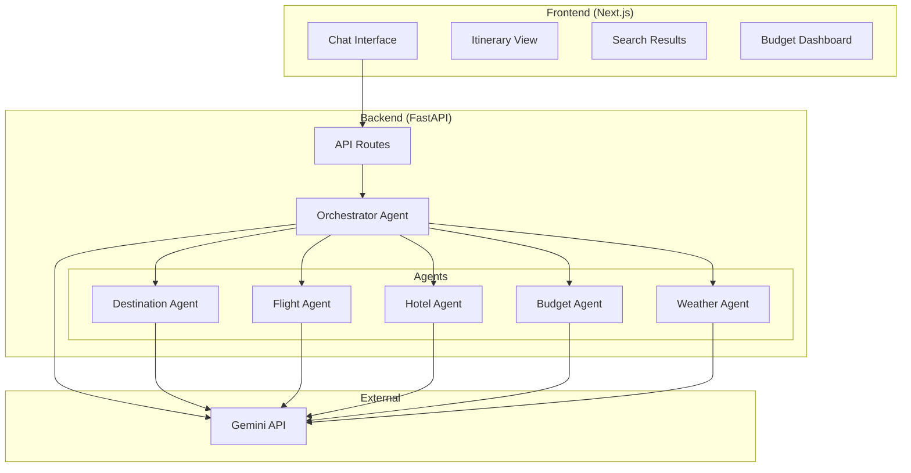

# 🧭 AI-Powered Travel Assistant — MVP Implementation Plan

## Goal

Build a **working MVP prototype** of the AI-Powered Multi-Agent Travel Assistant as defined in the PRD (Section 13 — MVP scope):

1. **Chat interface** — Conversational UX for travel queries
2. **Basic itinerary generation** — Multi-day trip plans via LLM
3. **Flight + Hotel search** — Real-time search results (simulated with realistic mock data for MVP)
4. **Budget estimation** — Cost breakdowns and allocation

The result will be a stunning, production-quality UI with a functional backend — ready for demo and iteration.

---

## User Review Required

> [!IMPORTANT]
> **LLM API Key**: The backend will use **Google Gemini** (free tier available) as the LLM for reasoning and itinerary generation. You'll need a `GEMINI_API_KEY`. If you prefer OpenAI or another provider, let me know.

> [!IMPORTANT]
> **Flight & Hotel Data**: For the MVP, I'll use **realistic mock/simulated data** for flights and hotels (generated by the LLM) rather than integrating paid APIs like Amadeus or Skyscanner. This lets us ship fast. Real API integration can come in v2.

---

## Open Questions

1. **Do you already have a Gemini or OpenAI API key?** If yes, which provider do you prefer?
2. **Any specific cities/routes you want demo'd?** (I'll make it work for any destination, but can pre-seed popular routes)
3. **Currency preference?** The PRD mentions ₹ (INR) — should I default to INR?

---

## Tech Stack

| Layer | Technology | Reason |
|-------|-----------|--------|
| **Frontend** | Next.js 14 (App Router) + Vanilla CSS | Modern React framework, SSR, great DX |
| **Backend** | Python FastAPI | Async, fast, perfect for AI/LLM workloads |
| **LLM** | Google Gemini API | Free tier, strong reasoning, tool-use support |
| **State** | In-memory (MVP) | Simple, no DB setup needed for prototype |
| **Styling** | Vanilla CSS with CSS variables | Full control, premium design system |

---

## Architecture



---

## Proposed Changes

### Component 1: Backend (Python FastAPI)

#### [NEW] `backend/requirements.txt`
- FastAPI, uvicorn, google-generativeai, pydantic, python-dotenv, httpx

#### [NEW] `backend/.env.example`
- Template for `GEMINI_API_KEY`

#### [NEW] `backend/main.py`
- FastAPI app with CORS middleware
- Health check endpoint
- Mount all API routes

#### [NEW] `backend/config.py`
- Load environment variables
- LLM configuration

#### [NEW] `backend/agents/base_agent.py`
- Base agent class with common LLM interaction pattern

#### [NEW] `backend/agents/orchestrator.py`
- **Supervisor Agent**: Routes user queries to specialized agents
- Manages conversation context
- Coordinates multi-agent responses

#### [NEW] `backend/agents/destination_agent.py`
- Suggests destinations based on preferences
- Generates personalized recommendations

#### [NEW] `backend/agents/flight_agent.py`
- Generates realistic flight search results
- Compares options (price, duration, stops)

#### [NEW] `backend/agents/hotel_agent.py`
- Generates hotel recommendations
- Filters by budget, rating, amenities

#### [NEW] `backend/agents/budget_agent.py`
- Cost breakdown calculation
- Budget allocation recommendations

#### [NEW] `backend/agents/weather_agent.py`
- Weather-aware suggestions (LLM-based knowledge)

#### [NEW] `backend/agents/itinerary_agent.py`
- Full itinerary generation with day-by-day plans
- Time-aware scheduling

#### [NEW] `backend/models/schemas.py`
- Pydantic models for all request/response types

#### [NEW] `backend/routes/chat.py`
- POST `/api/chat` — Main chat endpoint (streaming)
- POST `/api/chat/plan` — Generate full travel plan

#### [NEW] `backend/routes/search.py`
- POST `/api/search/flights` — Flight search
- POST `/api/search/hotels` — Hotel search

#### [NEW] `backend/routes/itinerary.py`
- POST `/api/itinerary/generate` — Generate itinerary
- GET `/api/itinerary/{id}` — Get saved itinerary

---

### Component 2: Frontend (Next.js)

#### [NEW] `frontend/` — Next.js App
- Initialized via `npx create-next-app`
- App Router structure

#### [NEW] `frontend/src/app/layout.js`
- Root layout with Google Fonts (Inter/Outfit)
- Global CSS import
- Meta tags for SEO

#### [NEW] `frontend/src/app/page.js`
- Landing/home page with hero section
- "Start Planning" CTA → navigates to chat

#### [NEW] `frontend/src/app/chat/page.js`
- Main chat interface
- Message history with streaming responses
- Quick action buttons (Search Flights, Find Hotels, etc.)

#### [NEW] `frontend/src/app/itinerary/page.js`
- Visual itinerary display
- Day-by-day timeline
- Cost breakdown sidebar

#### [NEW] `frontend/src/app/globals.css`
- Complete design system:
  - CSS custom properties (colors, spacing, typography)
  - Dark theme with glassmorphism
  - Animations and transitions
  - Responsive breakpoints

#### [NEW] `frontend/src/components/ChatMessage.js`
- Individual message component (user/assistant)
- Markdown rendering
- Typing indicator animation

#### [NEW] `frontend/src/components/FlightCard.js`
- Beautiful flight result card
- Airline, price, duration, stops

#### [NEW] `frontend/src/components/HotelCard.js`
- Hotel result card with rating, price, amenities

#### [NEW] `frontend/src/components/ItineraryTimeline.js`
- Day-by-day visual timeline
- Activities, transport, meals

#### [NEW] `frontend/src/components/BudgetBreakdown.js`
- Donut chart / progress bars for budget allocation
- Category breakdown

#### [NEW] `frontend/src/components/Sidebar.js`
- Navigation sidebar
- Trip summary
- Quick links

#### [NEW] `frontend/src/components/Header.js`
- Top navigation bar
- Logo, user avatar placeholder

#### [NEW] `frontend/src/lib/api.js`
- API client for backend communication
- Fetch wrappers with error handling

---

## Design Vision

- **Theme**: Dark mode with deep navy/indigo gradients, glass panels, neon accents
- **Typography**: Inter for body, Outfit for headings
- **Cards**: Frosted glass effect with subtle borders
- **Animations**: Smooth transitions, message slide-ins, typing indicators, hover glows
- **Layout**: Sidebar + main content area (chat-centric)
- **Mobile**: Fully responsive with collapsible sidebar

---

## File Structure

```
oxl-travel-agent/
├── backend/
│   ├── .env.example
│   ├── requirements.txt
│   ├── main.py
│   ├── config.py
│   ├── agents/
│   │   ├── __init__.py
│   │   ├── base_agent.py
│   │   ├── orchestrator.py
│   │   ├── destination_agent.py
│   │   ├── flight_agent.py
│   │   ├── hotel_agent.py
│   │   ├── budget_agent.py
│   │   ├── weather_agent.py
│   │   └── itinerary_agent.py
│   ├── models/
│   │   ├── __init__.py
│   │   └── schemas.py
│   └── routes/
│       ├── __init__.py
│       ├── chat.py
│       ├── search.py
│       └── itinerary.py
├── frontend/
│   ├── src/
│   │   ├── app/
│   │   │   ├── layout.js
│   │   │   ├── page.js
│   │   │   ├── globals.css
│   │   │   ├── chat/
│   │   │   │   └── page.js
│   │   │   └── itinerary/
│   │   │       └── page.js
│   │   ├── components/
│   │   │   ├── ChatMessage.js
│   │   │   ├── FlightCard.js
│   │   │   ├── HotelCard.js
│   │   │   ├── ItineraryTimeline.js
│   │   │   ├── BudgetBreakdown.js
│   │   │   ├── Sidebar.js
│   │   │   └── Header.js
│   │   └── lib/
│   │       └── api.js
│   └── package.json
├── prd.md
└── README.md
```

---

## Verification Plan

### Automated Tests
1. `cd backend && python -m pytest` — Test all agent responses
2. `cd frontend && npm run build` — Ensure frontend compiles without errors
3. Browser test: Navigate through chat → generate itinerary → view results

### Manual Verification
1. Start backend: `cd backend && uvicorn main:app --reload --port 8000`
2. Start frontend: `cd frontend && npm run dev`
3. Test user flow:
   - Open chat, type "Plan a 5-day trip to Goa under ₹50,000"
   - Verify itinerary generation with day-by-day breakdown
   - Verify flight and hotel search results appear
   - Verify budget breakdown is displayed
   - Test responsive design on mobile viewport

### Visual Verification
- Screenshot the landing page, chat interface, and itinerary view
- Verify glassmorphism effects, animations, and dark theme

---

## Implementation Order

1. **Backend foundation** — FastAPI app, config, models
2. **Agent system** — Base agent → specialized agents → orchestrator
3. **API routes** — Chat, search, itinerary endpoints
4. **Frontend foundation** — Next.js setup, design system (CSS)
5. **UI components** — Chat, cards, timeline, budget
6. **Pages** — Landing, chat, itinerary
7. **Integration** — Connect frontend ↔ backend
8. **Polish** — Animations, responsive design, error handling
